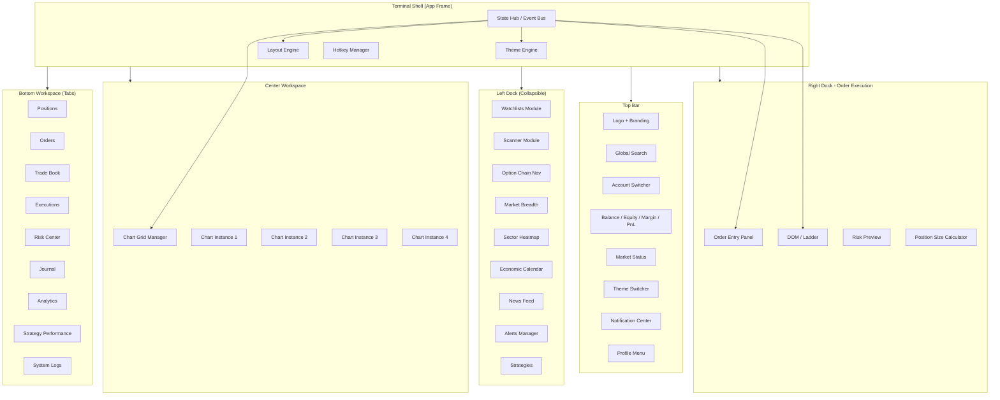
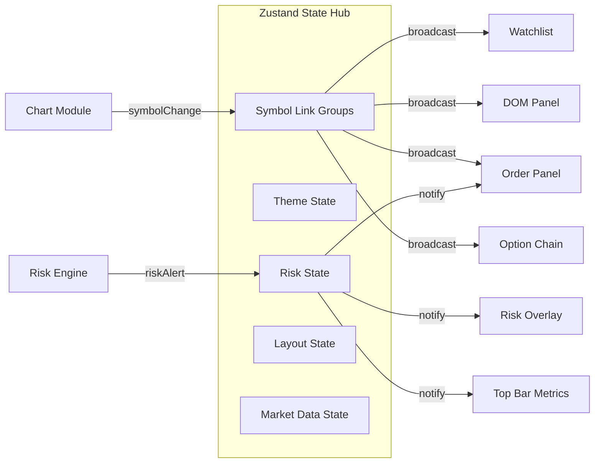
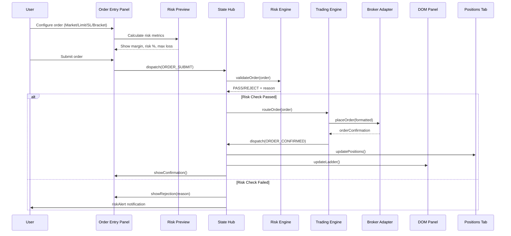
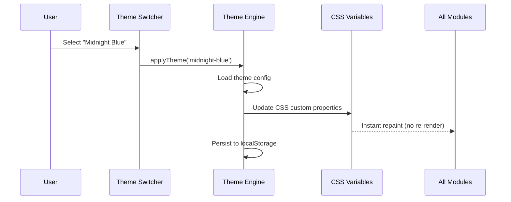
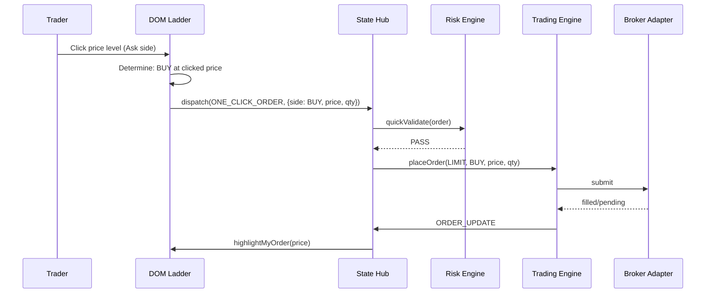

# Design Document: FundedWealth Terminal Enterprise UI

## Overview

FundedWealth Terminal Enterprise UI is an institutional-grade trading terminal interface architected as a modular, workspace-driven application. The system provides multi-layout charting, professional order execution, depth-of-market trading, options analytics, AI-powered insights, and comprehensive risk management — all within a themeable, high-density UI shell.

The architecture follows a plugin-based workspace pattern where each functional area (charts, options, scanners, analytics, journal, AI) is an independent workspace module that can be docked, tabbed, or popped out. A centralized state bus powered by Zustand coordinates cross-module communication (symbol linking, theme propagation, risk alerts) while maintaining module isolation for performance.

The target is a 100/100 professional score competing with Quantower, NinjaTrader, Bookmap, and Bloomberg Terminal-class workflows. This is not a dashboard — it is a full trading terminal with sub-millisecond UI responsiveness, zero-latency order execution, and institutional-grade data visualization.

## Architecture



### Module Communication Architecture



## Sequence Diagrams

### Order Execution Flow



### Theme Switch Flow



### DOM One-Click Trading Flow



## Components and Interfaces

### Component 1: Theme Engine

**Purpose**: Manages theme state, CSS variable injection, custom theme building, and profile-based density settings.

**Interface**:
```typescript
interface IThemeEngine {
  currentTheme: ThemeConfig;
  availableThemes: ThemePreset[];
  densityMode: 'compact' | 'normal' | 'comfortable';
  
  applyTheme(themeId: string): void;
  applyCustomTheme(config: CustomThemeConfig): void;
  setDensityMode(mode: DensityMode): void;
  applyProfile(profile: TradingProfile): void;
  exportTheme(): ThemeConfig;
  importTheme(config: ThemeConfig): void;
}

interface ThemeConfig {
  id: string;
  name: string;
  background: string;
  panelColor: string;
  accentColor: string;
  buyColor: string;
  sellColor: string;
  textPrimary: string;
  textSecondary: string;
  borderColor: string;
  fontSize: 'xs' | 'sm' | 'md' | 'lg';
  density: DensityMode;
}

type ThemePreset = 'dark-pro' | 'light-pro' | 'midnight-blue' 
  | 'trading-green' | 'bloomberg-orange' | 'custom';

type TradingProfile = 'scalper' | 'intraday' | 'swing' 
  | 'options-trader' | 'custom';
```

**Responsibilities**:
- Inject CSS custom properties on theme change (zero re-renders)
- Persist user theme preference to localStorage + server
- Apply density presets per trading profile
- Support custom theme builder with live preview

### Component 2: Layout Engine

**Purpose**: Manages workspace layouts, dock panels, tab systems, multi-chart grids, and drag-and-drop panel rearrangement.

**Interface**:
```typescript
interface ILayoutEngine {
  currentLayout: LayoutConfig;
  savedLayouts: LayoutPreset[];
  
  setChartLayout(mode: ChartLayoutMode): void;
  toggleLeftDock(): void;
  toggleRightDock(): void;
  resizePanel(panelId: string, dimensions: PanelDimensions): void;
  movePanel(panelId: string, target: DockPosition): void;
  saveLayout(name: string): void;
  loadLayout(layoutId: string): void;
  resetToDefault(): void;
}

type ChartLayoutMode = '1-chart' | '2-chart-h' | '2-chart-v' | '4-chart';

interface LayoutConfig {
  chartLayout: ChartLayoutMode;
  leftDock: { collapsed: boolean; width: number; activeModules: string[] };
  rightDock: { collapsed: boolean; width: number };
  bottomPanel: { height: number; activeTab: string };
  panels: PanelConfig[];
}

interface PanelConfig {
  id: string;
  position: DockPosition;
  dimensions: PanelDimensions;
  visible: boolean;
  minimized: boolean;
}
```

**Responsibilities**:
- Persist layout per user account
- Support drag-to-resize all panel borders
- Auto-collapse docks on smaller viewports
- Remember panel state across sessions

### Component 3: Order Execution Center

**Purpose**: Professional order entry with all order types, risk preview, position sizing, and one-click execution.

**Interface**:
```typescript
interface IOrderExecutionCenter {
  activeOrderType: OrderType;
  currentSymbol: SymbolInfo;
  riskPreview: RiskPreviewData;
  
  setOrderType(type: OrderType): void;
  setQuantity(qty: number): void;
  setPrice(price: number): void;
  setStopLoss(sl: number): void;
  setTakeProfit(tp: number): void;
  calculateRisk(): RiskPreviewData;
  submitOrder(): Promise<OrderResult>;
  submitBracketOrder(params: BracketParams): Promise<OrderResult>;
  submitBasketOrder(orders: OrderConfig[]): Promise<OrderResult[]>;
}

type OrderType = 'MARKET' | 'LIMIT' | 'SL' | 'SL-M' 
  | 'BRACKET' | 'OCO' | 'GTT' | 'BASKET' | 'ALGO';

interface BracketParams {
  entryPrice: number;
  stopLoss: number;
  takeProfit: number;
  trailingStop?: number;
  quantity: number;
  side: 'BUY' | 'SELL';
}

interface RiskPreviewData {
  marginRequired: number;
  marginAvailable: number;
  maxLoss: number;
  riskRewardRatio: number;
  positionSizeRecommended: number;
  accountRiskPercent: number;
  dailyLossAfterTrade: number;
  breachWarning: boolean;
}
```

### Component 4: DOM Panel (Depth of Market)

**Purpose**: Professional price ladder with 20 depth levels, one-click trading, draggable SL/TP, volume profile, and order flow visualization.

**Interface**:
```typescript
interface IDOMPanel {
  symbol: SymbolInfo;
  depthLevels: number; // 20
  ladder: LadderLevel[];
  myOrders: OrderOnLadder[];
  
  setDepthLevels(levels: number): void;
  placeOrderAtLevel(price: number, side: 'BUY' | 'SELL'): void;
  dragStopLoss(fromPrice: number, toPrice: number): void;
  dragTakeProfit(fromPrice: number, toPrice: number): void;
  cancelOrderAtLevel(price: number): void;
  centerOnLTP(): void;
}

interface LadderLevel {
  price: number;
  bidQty: number;
  askQty: number;
  bidOrders: number;
  askOrders: number;
  volume: number;       // traded volume at level
  delta: number;        // buy volume - sell volume
  myBuyOrders: number;
  mySellOrders: number;
  isLTP: boolean;
}
```

**Responsibilities**:
- Render 20 price levels with real-time depth updates
- Highlight LTP level with visual distinction
- Show user's orders on the ladder with drag capability
- One-click: click bid side to sell, ask side to buy
- Volume ladder showing cumulative traded volume per level
- Delta visualization (buying vs selling pressure)

### Component 5: Options Workspace

**Purpose**: Professional options analysis with live Greeks, strategy builder, payoff diagrams, and multi-leg order construction.

**Interface**:
```typescript
interface IOptionsWorkspace {
  underlying: string;
  expiry: string;
  chain: OptionChainData;
  strategies: OptionStrategy[];
  
  loadChain(underlying: string, expiry: string): void;
  selectStrike(strike: number, type: 'CE' | 'PE'): void;
  buildStrategy(legs: OptionLeg[]): StrategyAnalysis;
  calculatePayoff(strategy: OptionLeg[]): PayoffCurve;
  getGreeks(strike: number, type: 'CE' | 'PE'): Greeks;
  getMaxPain(underlying: string, expiry: string): number;
  getPCR(underlying: string, expiry: string): number;
}

interface OptionLeg {
  strike: number;
  type: 'CE' | 'PE';
  side: 'BUY' | 'SELL';
  qty: number;
  price: number;
}

interface Greeks {
  delta: number;
  gamma: number;
  theta: number;
  vega: number;
  iv: number;
}

interface StrategyAnalysis {
  maxProfit: number | 'unlimited';
  maxLoss: number;
  breakeven: number[];
  netPremium: number;
  netGreeks: Greeks;
  payoffCurve: PayoffPoint[];
}
```

### Component 6: Scanner Workspace

**Purpose**: Real-time market scanner with predefined and custom scan conditions, alert triggers, and saved scanner configurations.

**Interface**:
```typescript
interface IScannerWorkspace {
  activeScanners: ScannerConfig[];
  results: ScanResult[];
  
  runScanner(config: ScannerConfig): Promise<ScanResult[]>;
  createCustomScanner(conditions: ScanCondition[]): ScannerConfig;
  saveScanner(config: ScannerConfig): void;
  deleteScannerPreset(id: string): void;
  setAlert(scanner: ScannerConfig, alert: AlertConfig): void;
}

type ScanType = 'gap-up' | 'gap-down' | 'breakout' | 'volume-burst' 
  | 'oi-spike' | 'iv-expansion' | 'custom';

interface ScannerConfig {
  id: string;
  name: string;
  type: ScanType;
  conditions: ScanCondition[];
  universe: string[];  // watchlist or segment
  refreshInterval: number; // ms
}

interface ScanCondition {
  field: string;      // 'volume' | 'price' | 'oi' | 'iv' | etc.
  operator: 'gt' | 'lt' | 'eq' | 'gte' | 'lte' | 'crossAbove' | 'crossBelow';
  value: number | string;
  timeframe?: string;
}
```

### Component 7: AI Workspace

**Purpose**: AI-powered trading assistance with trade review, risk analysis, coaching, behavioral analysis, and automated summaries.

**Interface**:
```typescript
interface IAIWorkspace {
  modules: AIModule[];
  
  reviewTrade(tradeId: string): Promise<AITradeReview>;
  analyzeRisk(accountId: string): Promise<AIRiskAnalysis>;
  getDailySummary(date: string): Promise<AIDailySummary>;
  getWeeklySummary(weekStart: string): Promise<AIWeeklySummary>;
  analyzeBehavior(period: DateRange): Promise<BehaviorAnalysis>;
  getCoachingAdvice(context: Record<string, unknown>): Promise<CoachingResponse>;
}

interface AITradeReview {
  tradeId: string;
  entryQuality: number;   // 1-10
  exitQuality: number;    // 1-10
  riskManagement: number; // 1-10
  suggestions: string[];
  patterns: string[];
  emotionalState: string;
}

interface BehaviorAnalysis {
  overtrading: boolean;
  revengeTrading: boolean;
  fearOfMissing: boolean;
  consistencyScore: number;
  bestTimeOfDay: string;
  worstTimeOfDay: string;
  emotionalTriggers: string[];
}
```

### Component 8: Risk Center

**Purpose**: Comprehensive risk monitoring with daily loss tracking, max drawdown, trailing drawdown, profit targets, rule breach warnings, and emergency account locking.

**Interface**:
```typescript
interface IRiskCenter {
  currentMetrics: RiskMetrics;
  rules: RiskRule[];
  breaches: RiskBreach[];
  
  getDailyLoss(): number;
  getMaxDrawdown(): number;
  getTrailingDrawdown(): number;
  checkRuleStatus(ruleId: string): RuleStatus;
  getBreachWarnings(): RiskBreach[];
  emergencyLock(accountId: string): Promise<void>;
  emergencyKillSwitch(): Promise<void>; // Close all, lock all
}

interface RiskMetrics {
  dailyLoss: number;
  dailyLossLimit: number;
  dailyLossPercent: number;
  maxDrawdown: number;
  maxDrawdownLimit: number;
  trailingDrawdown: number;
  profitTarget: number;
  profitTargetLimit: number;
  openRisk: number;  // sum of all open position risk
  ruleStatus: RuleStatus[];
}

interface RiskBreach {
  type: 'warning' | 'breach' | 'lock';
  rule: string;
  currentValue: number;
  limitValue: number;
  percentUsed: number;
  timestamp: Date;
  action: 'notify' | 'restrict' | 'lock';
}

type RuleStatus = {
  ruleId: string;
  name: string;
  status: 'safe' | 'warning' | 'critical' | 'breached';
  percentUsed: number;
};
```

### Component 9: Journal Workspace

**Purpose**: Trade journaling with auto-capture, screenshot annotation, emotion tracking, mistake categorization, and strategy tagging.

**Interface**:
```typescript
interface IJournalWorkspace {
  entries: JournalEntry[];
  tags: JournalTag[];
  
  createEntry(trade: TradeReference): JournalEntry;
  autoCapture(trade: TradeData): JournalEntry;
  addScreenshot(entryId: string, screenshot: Blob): void;
  addNote(entryId: string, note: string): void;
  tagMistake(entryId: string, mistake: MistakeType): void;
  tagEmotion(entryId: string, emotion: EmotionType): void;
  tagStrategy(entryId: string, strategy: string): void;
  getAnalytics(dateRange: DateRange): JournalAnalytics;
}

type MistakeType = 'fomo' | 'revenge' | 'oversize' | 'no-sl' 
  | 'moved-sl' | 'early-exit' | 'late-entry' | 'against-trend' | 'custom';

type EmotionType = 'confident' | 'fearful' | 'greedy' | 'calm' 
  | 'frustrated' | 'euphoric' | 'anxious' | 'neutral';

interface JournalEntry {
  id: string;
  tradeId: string;
  symbol: string;
  side: 'BUY' | 'SELL';
  pnl: number;
  screenshots: string[];
  notes: string;
  mistakes: MistakeType[];
  emotions: EmotionType[];
  strategyTags: string[];
  rating: number; // 1-5
  createdAt: Date;
}
```

### Component 10: Analytics Workspace

**Purpose**: Performance analytics with comprehensive metrics, heat calendars, performance curves, and setup analysis.

**Interface**:
```typescript
interface IAnalyticsWorkspace {
  metrics: PerformanceMetrics;
  curves: PerformanceCurve[];
  
  getMetrics(dateRange: DateRange): PerformanceMetrics;
  getEquityCurve(dateRange: DateRange): EquityPoint[];
  getHeatCalendar(year: number): HeatCalendarData;
  getBestSetups(limit: number): SetupAnalysis[];
  getWorstSetups(limit: number): SetupAnalysis[];
  getDrawdownAnalysis(): DrawdownPeriod[];
  exportReport(format: 'pdf' | 'csv'): Promise<Blob>;
}

interface PerformanceMetrics {
  winRate: number;
  profitFactor: number;
  sharpeRatio: number;
  expectancy: number;
  maxDrawdown: number;
  maxDrawdownDuration: number; // days
  avgWin: number;
  avgLoss: number;
  largestWin: number;
  largestLoss: number;
  totalTrades: number;
  avgTradesPerDay: number;
  avgHoldingTime: number; // minutes
  bestDay: number;
  worstDay: number;
  consecutiveWins: number;
  consecutiveLosses: number;
}

interface HeatCalendarData {
  year: number;
  days: Array<{ date: string; pnl: number; trades: number }>;
}
```

### Component 11: Founder Scale Features

**Purpose**: Multi-account management, master-slave trading, portfolio/firm/sector exposure monitoring, and emergency kill switch.

**Interface**:
```typescript
interface IFounderScale {
  accounts: TradingAccount[];
  masterAccount: string | null;
  
  setMasterAccount(accountId: string): void;
  addSlaveAccount(accountId: string): void;
  removeSlaveAccount(accountId: string): void;
  getMasterSlaveMapping(): MasterSlaveConfig;
  getPortfolioExposure(): ExposureData;
  getFirmExposure(): ExposureData;
  getSymbolExposure(symbol: string): SymbolExposure;
  getSectorExposure(): SectorExposure[];
  emergencyKillSwitch(): Promise<KillSwitchResult>;
}

interface MasterSlaveConfig {
  masterId: string;
  slaveIds: string[];
  copyRatio: Record<string, number>; // accountId -> multiplier
  copyMode: 'mirror' | 'proportional' | 'fixed-lot';
}

interface KillSwitchResult {
  accountsClosed: string[];
  positionsClosed: number;
  orderssCancelled: number;
  totalPnL: number;
  executionTime: number; // ms
}
```

## Data Models

### Theme Data Model

```typescript
interface ThemeStore {
  // State
  activeThemeId: string;
  themes: Record<string, ThemeConfig>;
  densityMode: DensityMode;
  fontSize: FontSize;
  activeProfile: TradingProfile;
  customThemes: ThemeConfig[];

  // Actions
  setTheme: (id: string) => void;
  setDensity: (mode: DensityMode) => void;
  setFontSize: (size: FontSize) => void;
  setProfile: (profile: TradingProfile) => void;
  createCustomTheme: (config: Partial<ThemeConfig>) => string;
  deleteCustomTheme: (id: string) => void;
}

type DensityMode = 'compact' | 'normal' | 'comfortable';
type FontSize = 'xs' | 'sm' | 'md' | 'lg';
```

**Validation Rules**:
- Theme colors must be valid hex or HSL values
- Font size must be one of the predefined sizes
- Custom theme name must be unique and non-empty
- Density mode affects padding/spacing CSS variables globally

### Layout Data Model

```typescript
interface LayoutStore {
  // State
  chartLayout: ChartLayoutMode;
  leftDock: DockState;
  rightDock: DockState;
  bottomPanel: BottomPanelState;
  activeWorkspace: WorkspaceType;
  savedLayouts: LayoutPreset[];
  
  // Actions
  setChartLayout: (mode: ChartLayoutMode) => void;
  toggleDock: (side: 'left' | 'right') => void;
  setBottomTab: (tab: BottomTab) => void;
  resizeBottom: (height: number) => void;
  switchWorkspace: (workspace: WorkspaceType) => void;
  saveCurrentLayout: (name: string) => void;
  loadLayout: (id: string) => void;
}

type WorkspaceType = 'trading' | 'options' | 'scanner' | 'heatmap' 
  | 'news' | 'ai' | 'journal' | 'analytics';

type BottomTab = 'positions' | 'orders' | 'tradebook' | 'executions' 
  | 'risk' | 'journal' | 'analytics' | 'strategy' | 'logs';

interface DockState {
  collapsed: boolean;
  width: number;
  minWidth: number;
  maxWidth: number;
}
```

**Validation Rules**:
- Dock width must be between minWidth (200px) and maxWidth (600px)
- Bottom panel height must be between 150px and 50% viewport height
- At least one chart must be visible in any layout mode
- Layout presets are limited to 20 per user

### Market Data Model

```typescript
interface MarketDataStore {
  // State
  quotes: Record<string, QuoteData>;
  depth: Record<string, DepthData>;
  subscribedTokens: Set<string>;
  marketStatus: MarketStatus;
  
  // Actions
  subscribe: (tokens: string[]) => void;
  unsubscribe: (tokens: string[]) => void;
  updateQuote: (token: string, data: QuoteData) => void;
  updateDepth: (token: string, data: DepthData) => void;
  setMarketStatus: (status: MarketStatus) => void;
}

interface QuoteData {
  token: string;
  symbol: string;
  ltp: number;
  open: number;
  high: number;
  low: number;
  close: number;
  volume: number;
  change: number;
  changePercent: number;
  bid: number;
  ask: number;
  bidQty: number;
  askQty: number;
  oi: number;
  oiChange: number;
  timestamp: number;
}

interface DepthData {
  token: string;
  bids: Array<{ price: number; qty: number; orders: number }>;
  asks: Array<{ price: number; qty: number; orders: number }>;
  totalBuyQty: number;
  totalSellQty: number;
  imbalance: number; // (totalBuy - totalSell) / (totalBuy + totalSell)
}
```

### Trading Data Model

```typescript
interface TradingStore {
  // State
  positions: Position[];
  orders: Order[];
  trades: Trade[];
  funds: FundsData;
  activeAccount: TradingAccount;
  
  // Actions
  placeOrder: (config: OrderConfig) => Promise<OrderResult>;
  modifyOrder: (orderId: string, changes: Partial<OrderConfig>) => Promise<void>;
  cancelOrder: (orderId: string) => Promise<void>;
  cancelAllOrders: () => Promise<void>;
  closePosition: (positionId: string) => Promise<void>;
  closeAllPositions: () => Promise<void>;
  switchAccount: (accountId: string) => void;
}

interface Position {
  id: string;
  symbol: string;
  token: string;
  segment: string;
  side: 'LONG' | 'SHORT';
  qty: number;
  avgPrice: number;
  ltp: number;
  pnl: number;
  pnlPercent: number;
  productType: 'MIS' | 'CNC' | 'NRML';
  stopLoss: number | null;
  takeProfit: number | null;
  openedAt: Date;
}

interface Order {
  id: string;
  symbol: string;
  token: string;
  side: 'BUY' | 'SELL';
  orderType: OrderType;
  productType: string;
  qty: number;
  price: number | null;
  triggerPrice: number | null;
  filledQty: number;
  avgPrice: number | null;
  status: OrderStatus;
  placedAt: Date;
  updatedAt: Date;
}

type OrderStatus = 'PENDING' | 'OPEN' | 'FILLED' | 'PARTIALLY_FILLED' 
  | 'CANCELLED' | 'REJECTED' | 'TRIGGERED';
```

## Algorithmic Pseudocode

### Theme Application Algorithm

```typescript
ALGORITHM applyTheme(themeId: string)
INPUT: themeId - identifier of theme to apply
OUTPUT: void - CSS variables updated, UI repainted

BEGIN
  ASSERT themeId is non-empty string
  ASSERT themes[themeId] exists OR customThemes[themeId] exists
  
  // Step 1: Resolve theme configuration
  config ← resolveThemeConfig(themeId)
  
  // Step 2: Inject CSS custom properties (no React re-render)
  root ← document.documentElement
  FOR each [key, value] IN config.cssVariables DO
    ASSERT value is valid CSS color or dimension
    root.style.setProperty(`--${key}`, value)
  END FOR
  
  // Step 3: Apply density mode
  root.dataset.density ← config.density
  
  // Step 4: Persist preference
  localStorage.set('fw-theme', themeId)
  syncToServer(userId, { theme: themeId })
  
  // Step 5: Update state
  state.activeThemeId ← themeId
  
  ASSERT document.documentElement.style contains all theme variables
END
```

**Preconditions:**
- `themeId` references a valid theme (built-in or custom)
- Document root element is accessible

**Postconditions:**
- All CSS custom properties are updated
- No React component re-renders triggered
- Theme persisted to localStorage and server
- UI visually reflects new theme within 16ms (one frame)

**Loop Invariants:**
- Each CSS variable set is a valid CSS value
- Previous variables remain set during iteration

### DOM Ladder Rendering Algorithm

```typescript
ALGORITHM renderDOMLadder(depthData: DepthData, ltp: number, levels: number)
INPUT: depthData - current order book, ltp - last traded price, levels - depth levels (20)
OUTPUT: LadderLevel[] - array of rendered price levels

BEGIN
  ASSERT levels > 0 AND levels <= 40
  ASSERT ltp > 0
  ASSERT depthData.bids.length > 0 OR depthData.asks.length > 0
  
  // Step 1: Calculate price range centered on LTP
  tickSize ← getTickSize(symbol)
  halfRange ← levels / 2
  topPrice ← ltp + (halfRange * tickSize)
  bottomPrice ← ltp - (halfRange * tickSize)
  
  // Step 2: Build ladder levels
  ladder ← []
  FOR price FROM topPrice DOWN TO bottomPrice STEP tickSize DO
    ASSERT price > 0
    
    level ← {
      price: price,
      bidQty: findBidAtPrice(depthData.bids, price),
      askQty: findAskAtPrice(depthData.asks, price),
      volume: getVolumeAtPrice(price),
      delta: getBuyVolume(price) - getSellVolume(price),
      myBuyOrders: getMyOrdersAtPrice(price, 'BUY'),
      mySellOrders: getMyOrdersAtPrice(price, 'SELL'),
      isLTP: Math.abs(price - ltp) < tickSize / 2
    }
    ladder.push(level)
  END FOR
  
  ASSERT ladder.length === levels
  ASSERT exactly one level has isLTP === true
  
  RETURN ladder
END
```

**Preconditions:**
- Valid depth data with at least one side populated
- LTP is a positive number
- Symbol tick size is known

**Postconditions:**
- Returns exactly `levels` ladder entries
- Exactly one entry marked as LTP level
- Prices are in descending order (highest at top)
- All quantities are non-negative

**Loop Invariants:**
- Price decreases by exactly tickSize each iteration
- All constructed levels have valid non-negative quantities

### Risk Evaluation Algorithm

```typescript
ALGORITHM evaluatePreTradeRisk(order: OrderConfig, account: TradingAccount)
INPUT: order - proposed order, account - current account state
OUTPUT: RiskDecision - PASS with preview or REJECT with reason

BEGIN
  ASSERT order.qty > 0
  ASSERT order.symbol is valid tradeable instrument
  ASSERT account.status === 'active'
  
  // Step 1: Check market hours
  IF NOT isMarketOpen(order.segment) THEN
    RETURN { decision: 'REJECT', reason: 'Market closed for segment' }
  END IF
  
  // Step 2: Check allowed segments
  IF order.segment NOT IN account.allowedSegments THEN
    RETURN { decision: 'REJECT', reason: 'Segment not allowed' }
  END IF
  
  // Step 3: Calculate margin requirement
  marginRequired ← calculateMargin(order)
  IF marginRequired > account.freeMargin THEN
    RETURN { decision: 'REJECT', reason: 'Insufficient margin' }
  END IF
  
  // Step 4: Check position limits
  openPositions ← countOpenPositions(account.id)
  IF openPositions >= account.maxPositions THEN
    RETURN { decision: 'REJECT', reason: 'Max positions reached' }
  END IF
  
  // Step 5: Check daily loss limit
  currentDailyLoss ← getDailyLoss(account.id)
  potentialLoss ← calculateMaxLoss(order)
  IF (currentDailyLoss + potentialLoss) > account.dailyLossLimit THEN
    RETURN { decision: 'REJECT', reason: 'Would breach daily loss limit' }
  END IF
  
  // Step 6: Check max drawdown
  currentDrawdown ← getDrawdown(account.id)
  IF (currentDrawdown + potentialLoss) > account.maxDrawdownLimit THEN
    RETURN { decision: 'REJECT', reason: 'Would breach max drawdown' }
  END IF
  
  // Step 7: Check lot size limits
  IF order.qty > account.maxLotSize THEN
    RETURN { decision: 'REJECT', reason: 'Exceeds max lot size' }
  END IF
  
  // Step 8: Build risk preview
  preview ← {
    marginRequired,
    marginAvailable: account.freeMargin - marginRequired,
    maxLoss: potentialLoss,
    riskRewardRatio: calculateRR(order),
    accountRiskPercent: (potentialLoss / account.balance) * 100,
    dailyLossAfterTrade: currentDailyLoss + potentialLoss,
    breachWarning: (currentDailyLoss + potentialLoss) > account.dailyLossLimit * 0.8
  }
  
  RETURN { decision: 'PASS', preview }
END
```

**Preconditions:**
- Order has valid symbol, positive quantity, and valid order type
- Account is active and not locked
- Market data is available for margin calculation

**Postconditions:**
- If PASS: preview contains all risk metrics, order is safe to execute
- If REJECT: reason clearly explains which rule was violated
- No state mutation occurs during evaluation

**Loop Invariants:** N/A (sequential checks with early return)

### Scanner Execution Algorithm

```typescript
ALGORITHM executeScanner(config: ScannerConfig, universe: Instrument[])
INPUT: config - scanner configuration, universe - instruments to scan
OUTPUT: ScanResult[] - matching instruments sorted by relevance

BEGIN
  ASSERT config.conditions.length > 0
  ASSERT universe.length > 0
  
  results ← []
  
  // Step 1: Evaluate each instrument against conditions
  FOR each instrument IN universe DO
    ASSERT instrument.token is subscribed to market data
    
    quote ← getLatestQuote(instrument.token)
    IF quote is stale (age > 5s) THEN
      CONTINUE  // Skip stale data
    END IF
    
    // Step 2: Check all conditions (AND logic)
    allMatch ← true
    matchScore ← 0
    
    FOR each condition IN config.conditions DO
      fieldValue ← extractField(quote, condition.field)
      matched ← evaluateCondition(fieldValue, condition.operator, condition.value)
      
      IF NOT matched THEN
        allMatch ← false
        BREAK
      END IF
      
      matchScore ← matchScore + calculateRelevance(fieldValue, condition)
    END FOR
    
    IF allMatch THEN
      results.push({ instrument, quote, score: matchScore, timestamp: now() })
    END IF
  END FOR
  
  // Step 3: Sort by relevance score
  results.sort((a, b) => b.score - a.score)
  
  ASSERT results every item satisfies all conditions
  RETURN results
END
```

**Preconditions:**
- All instruments in universe have active market data subscriptions
- Scanner conditions reference valid fields

**Postconditions:**
- Results only contain instruments satisfying ALL conditions
- Results are sorted by relevance (highest first)
- No stale data included (< 5s age)

**Loop Invariants:**
- Outer loop: All previously processed instruments were correctly evaluated
- Inner loop: All previously checked conditions were satisfied (until break)

## Key Functions with Formal Specifications

### Function: calculatePositionSize()

```typescript
function calculatePositionSize(
  balance: number,
  riskPercent: number,
  entryPrice: number,
  stopLoss: number,
  tickSize: number,
  lotSize: number
): PositionSizeResult
```

**Preconditions:**
- `balance > 0`
- `0 < riskPercent <= 100`
- `entryPrice > 0`
- `stopLoss > 0` and `stopLoss !== entryPrice`
- `tickSize > 0`
- `lotSize > 0`

**Postconditions:**
- `result.qty` is a positive integer multiple of `lotSize`
- `result.riskAmount <= balance * (riskPercent / 100)`
- `result.qty * |entryPrice - stopLoss| <= balance * (riskPercent / 100)`
- If calculated qty < lotSize, returns lotSize with warning

**Loop Invariants:** N/A

### Function: buildOptionPayoff()

```typescript
function buildOptionPayoff(
  legs: OptionLeg[],
  spotRange: [number, number],
  steps: number
): PayoffCurve
```

**Preconditions:**
- `legs.length >= 1 && legs.length <= 6`
- Each leg has valid strike > 0, qty > 0, price >= 0
- `spotRange[0] < spotRange[1]`
- `steps > 0 && steps <= 1000`

**Postconditions:**
- Returns exactly `steps` payoff points
- Each point has spot price and corresponding P&L
- Breakeven points are accurately identified (sign change in P&L)
- Max profit and max loss correctly calculated from curve extremes

**Loop Invariants:**
- Each computed payoff point is at evenly spaced price intervals
- P&L calculation uses Black-Scholes intrinsic value at expiry

### Function: syncThemeToCSS()

```typescript
function syncThemeToCSS(config: ThemeConfig): void
```

**Preconditions:**
- `config` contains all required theme properties
- All color values are valid CSS colors (hex, rgb, hsl)
- Document root element exists and is accessible

**Postconditions:**
- All CSS custom properties updated on document root
- No React component re-render triggered
- Theme change visually reflected within 16ms
- Previous theme fully overwritten (no stale variables)

**Loop Invariants:**
- Each CSS variable set is a valid CSS value before moving to next

### Function: emergencyKillSwitch()

```typescript
async function emergencyKillSwitch(
  accounts: TradingAccount[]
): Promise<KillSwitchResult>
```

**Preconditions:**
- `accounts.length >= 1`
- User has kill switch permission
- At least one account has open positions or pending orders

**Postconditions:**
- ALL pending orders across ALL accounts are cancelled
- ALL open positions across ALL accounts are closed at market
- ALL accounts are locked (status = 'locked')
- Result contains total P&L from all closed positions
- Execution completes within 5000ms (hard timeout with partial result)
- Event logged for audit trail

**Loop Invariants:**
- Each processed account has all orders cancelled before positions closed
- Account lock applied after all positions closed for that account

## Example Usage

```typescript
// Example 1: Theme switching
const themeStore = useThemeStore();
themeStore.setTheme('midnight-blue');
themeStore.setDensity('compact');
themeStore.setProfile('scalper'); // auto-applies compact + small font

// Example 2: One-click DOM trading
const domPanel = useDOMPanel();
domPanel.placeOrderAtLevel(19850.50, 'BUY'); // Buy at clicked price
domPanel.dragStopLoss(19800, 19820);         // Drag SL up on ladder

// Example 3: Option strategy building
const optionsWorkspace = useOptionsWorkspace();
const ironCondor = optionsWorkspace.buildStrategy([
  { strike: 19500, type: 'PE', side: 'SELL', qty: 50, price: 45 },
  { strike: 19400, type: 'PE', side: 'BUY', qty: 50, price: 25 },
  { strike: 20000, type: 'CE', side: 'SELL', qty: 50, price: 40 },
  { strike: 20100, type: 'CE', side: 'BUY', qty: 50, price: 20 },
]);
// ironCondor.maxProfit = 2000, ironCondor.maxLoss = 3000

// Example 4: Risk evaluation before order
const riskCenter = useRiskCenter();
const decision = await riskCenter.evaluatePreTradeRisk({
  symbol: 'NIFTY24JUNFUT',
  side: 'BUY',
  qty: 50,
  orderType: 'LIMIT',
  price: 19850,
  stopLoss: 19800,
});
if (decision.decision === 'PASS') {
  console.log('Margin required:', decision.preview.marginRequired);
  console.log('Account risk:', decision.preview.accountRiskPercent, '%');
}

// Example 5: Scanner execution
const scanner = useScannerWorkspace();
const results = await scanner.runScanner({
  id: 'volume-burst',
  name: 'Volume Burst Scanner',
  type: 'volume-burst',
  conditions: [
    { field: 'volume', operator: 'gt', value: 'avg_volume_20 * 3' },
    { field: 'changePercent', operator: 'gt', value: 1 },
  ],
  universe: ['NIFTY50'],
  refreshInterval: 5000,
});

// Example 6: Emergency Kill Switch
const founderScale = useFounderScale();
const result = await founderScale.emergencyKillSwitch();
// result: { accountsClosed: ['FW-10001', 'FW-10002'], positionsClosed: 8, ... }

// Example 7: AI Trade Review
const ai = useAIWorkspace();
const review = await ai.reviewTrade('trade-123');
// review: { entryQuality: 7, exitQuality: 4, suggestions: ['Exit was premature...'] }

// Example 8: Layout management
const layout = useLayoutStore();
layout.setChartLayout('4-chart');
layout.toggleDock('left'); // collapse left dock for more chart space
layout.switchWorkspace('options'); // switch to options workspace
```

## Correctness Properties

*A property is a characteristic or behavior that should hold true across all valid executions of a system — essentially, a formal statement about what the system should do. Properties serve as the bridge between human-readable specifications and machine-verifiable correctness guarantees.*

### Property 1: Theme application is atomic and complete

*For any* valid theme configuration, applying the theme SHALL update all CSS custom properties on the document root, apply density-specific padding/spacing uniformly across all visible panels, and produce no partial state where some variables are from the old theme and some from the new.

**Validates: Requirements 1.1, 1.3, 1.4**

### Property 2: Theme persistence round-trip

*For any* valid theme ID applied through the Theme_Engine, reading the persisted value from localStorage SHALL return the same theme ID that was applied.

**Validates: Requirements 1.2**

### Property 3: Theme validation rejects invalid configurations

*For any* theme configuration with invalid CSS color values, missing required fields, or a non-unique/empty name, the Theme_Engine SHALL reject the configuration and fall back to the default theme without crashing.

**Validates: Requirements 1.5, 1.7**

### Property 4: Layout dock width is always clamped

*For any* resize operation on a dock panel, the resulting width SHALL be between 200 pixels (minimum) and 600 pixels (maximum) regardless of the drag distance.

**Validates: Requirements 2.2**

### Property 5: Layout state round-trip

*For any* valid layout configuration, saving the layout and then loading it back SHALL produce a layout state equal to the original.

**Validates: Requirements 2.3, 2.7**

### Property 6: Layout always shows at least one chart

*For any* sequence of layout operations (dock toggle, workspace switch, panel resize, chart layout change), at least one chart SHALL remain visible.

**Validates: Requirements 2.5**

### Property 7: Risk engine rejects over-limit orders

*For any* proposed order and account state, if the order's potential loss plus current daily loss exceeds the daily loss limit, OR the order's margin exceeds free margin, OR the drawdown would exceed the max drawdown limit, OR open positions are at maximum, OR the order quantity exceeds max lot size, OR the segment is not in the allowed list, the Risk_Center SHALL reject the order.

**Validates: Requirements 8.2, 8.3, 8.4, 8.5, 8.6, 8.8**

### Property 8: Risk warning triggers at threshold

*For any* account state where daily loss divided by daily loss limit is greater than or equal to 0.8, the Risk_Center SHALL display a breach warning.

**Validates: Requirements 8.1**

### Property 9: Position size never exceeds risk limit and is lot-aligned

*For any* valid inputs (balance, risk percentage, entry price, stop-loss price, lot size), the calculated position size SHALL satisfy: (quantity × |entry - stopLoss|) ≤ (balance × riskPercent / 100) AND quantity is a positive integer multiple of lot size.

**Validates: Requirements 9.1, 9.2, 9.4**

### Property 10: Order execution is idempotent

*For any* order submitted twice with the same client-generated nonce, the system SHALL place exactly one order — the duplicate submission SHALL be rejected.

**Validates: Requirements 3.6**

### Property 11: DOM ladder has correct structure

*For any* depth data and LTP value, the rendered DOM ladder SHALL contain exactly the configured number of levels with exactly one level marked as the LTP level, with prices in descending order from top to bottom.

**Validates: Requirements 4.1, 4.2**

### Property 12: DOM delta calculation correctness

*For any* depth data update, the delta value at each price level SHALL equal the buy volume minus the sell volume at that level.

**Validates: Requirements 4.8**

### Property 13: Options strategy net calculations

*For any* valid multi-leg options strategy (1-6 legs), the net premium SHALL equal the sum of individual leg premiums (considering buy/sell side), and the net Greeks SHALL equal the sum of individual leg Greeks weighted by quantity and side.

**Validates: Requirements 5.2**

### Property 14: Payoff curve correctness

*For any* options strategy and spot price range, the payoff diagram SHALL contain evenly spaced price points, and breakeven points SHALL be identified at every location where the P&L curve changes sign.

**Validates: Requirements 5.3, 5.4**

### Property 15: Put-Call Ratio accuracy

*For any* underlying and expiry with non-zero call open interest, the Put-Call Ratio SHALL equal total put open interest divided by total call open interest.

**Validates: Requirements 5.6**

### Property 16: Scanner results satisfy all conditions and are sorted

*For any* scanner execution, every instrument in the results SHALL satisfy all configured scan conditions (AND logic), and results SHALL be sorted in descending order by relevance score.

**Validates: Requirements 6.1, 6.2**

### Property 17: Scanner excludes stale data

*For any* instrument with market data older than 5 seconds at the time of scanner evaluation, the instrument SHALL be excluded from scanner results.

**Validates: Requirements 6.3**

### Property 18: Scanner condition validation

*For any* custom scanner configuration, the Scanner_Workspace SHALL accept conditions that reference valid fields and operators, and reject conditions that reference invalid fields or operators.

**Validates: Requirements 6.5**

### Property 19: Kill switch rate limiting

*For any* two kill switch invocations, if the second invocation occurs within 60 seconds of the first, the system SHALL reject the second invocation.

**Validates: Requirements 10.8**

### Property 20: Journal auto-capture completeness

*For any* completed trade, the auto-captured journal entry SHALL contain the trade's symbol, side, P&L, and timestamp.

**Validates: Requirements 11.1**

### Property 21: Analytics metrics mathematical consistency

*For any* set of trades in a period, win rate SHALL equal winning trades divided by total trades, profit factor SHALL equal gross profit divided by gross loss, and the final equity curve point SHALL equal total cumulative P&L.

**Validates: Requirements 12.1, 12.2**

### Property 22: Heat calendar aggregation correctness

*For any* year's trade data, each day in the heat calendar SHALL show P&L equal to the sum of all trade P&Ls on that day, and trade count equal to the number of trades on that day.

**Validates: Requirements 12.3**

### Property 23: Master-slave replication ratio

*For any* master account order and slave account configuration, the replicated order quantity on each slave SHALL equal the master quantity multiplied by the slave's copy ratio (rounded to lot size).

**Validates: Requirements 13.1**

### Property 24: Portfolio exposure aggregation

*For any* set of positions across multiple accounts, the portfolio exposure for a symbol SHALL equal the sum of all position quantities for that symbol across all accounts.

**Validates: Requirements 13.2**

### Property 25: WebSocket exponential backoff

*For any* reconnection attempt number N, the backoff delay SHALL equal min(2^(N-1) seconds, 30 seconds).

**Validates: Requirements 14.4**

### Property 26: Market data UI throttling

*For any* symbol receiving rapid market data updates, the State_Hub SHALL render at most 5 UI updates per second for that symbol, always displaying the latest value.

**Validates: Requirements 14.5**

### Property 27: Panel subscription lifecycle

*For any* panel that transitions from visible to hidden or minimized, the Terminal_Shell SHALL unsubscribe its market data subscriptions, and when the panel becomes visible again, subscriptions SHALL be restored.

**Validates: Requirements 16.5**

## Error Handling

### Error Scenario 1: WebSocket Disconnection

**Condition**: Market data WebSocket connection drops mid-session
**Response**: 
- Immediately show "Reconnecting..." banner in TopBar
- Freeze all LTP values with stale indicator (dim opacity)
- Disable one-click trading on DOM panel
- Attempt reconnection with exponential backoff (1s, 2s, 4s, 8s, max 30s)
**Recovery**: 
- On reconnect: re-subscribe all tokens, refresh full depth
- Flash-highlight updated prices to show data is live again
- Re-enable one-click trading after 3 consecutive successful ticks

### Error Scenario 2: Order Rejection from Broker

**Condition**: Broker API returns rejection after risk engine already approved
**Response**:
- Show toast notification with rejection reason
- Update order status to REJECTED in orders tab
- Release margin hold from risk preview
- Log discrepancy for debugging (risk engine said OK but broker said no)
**Recovery**:
- Auto-refresh funds/margin from broker to resync state
- Show suggestion to user (e.g., "Reduce qty" or "Check margin")

### Error Scenario 3: Kill Switch Partial Failure

**Condition**: Some accounts/positions fail to close during emergency kill
**Response**:
- Continue closing remaining positions (don't stop on first failure)
- Lock accounts that were successfully closed
- Show detailed status: "Closed 6/8 positions, 2 failed"
- Auto-retry failed closures every 2 seconds for 30 seconds
**Recovery**:
- Manual intervention UI for remaining positions
- Alert sent to admin/firm dashboard
- Account remains in "emergency" state until fully resolved

### Error Scenario 4: Theme Load Failure

**Condition**: Custom theme config is corrupted or invalid
**Response**:
- Fall back to default "Dark Pro" theme
- Show toast: "Custom theme could not be loaded, using default"
- Remove corrupted theme from localStorage
**Recovery**:
- Offer to rebuild custom theme from last known good state
- Sync correct theme from server if available

### Error Scenario 5: Stale Market Data in Scanner

**Condition**: Scanner evaluates conditions against data older than 5 seconds
**Response**:
- Skip stale instruments in scanner results
- Show warning badge: "X instruments excluded (stale data)"
- Continue scanning instruments with fresh data
**Recovery**:
- Auto-retry stale instruments on next scan cycle
- If persistent, show "Market data connection issue" alert

## Testing Strategy

### Unit Testing Approach

- **Theme Engine**: Test CSS variable injection, theme switching, density application, custom theme validation
- **Risk Engine**: Test all rule evaluations (daily loss, drawdown, margin, position limits) with edge cases
- **Position Calculator**: Test position sizing with various risk parameters, verify lot rounding
- **DOM Ladder**: Test ladder construction, price centering, order placement logic
- **Scanner Engine**: Test condition evaluation with various operators, universe filtering

**Coverage Goal**: 90%+ for business logic (risk engine, position calculator, scanner conditions)

### Property-Based Testing Approach

**Property Test Library**: fast-check

Key properties to test:
1. Risk engine: For any valid order, if approved, resulting state stays within all limits
2. Position calculator: For any valid inputs, result.qty * risk_per_unit ≤ max_risk_amount
3. Theme engine: For any valid theme config, all CSS variables are valid CSS values
4. DOM ladder: For any depth data and LTP, ladder has exactly N levels with one LTP marker
5. Scanner: For any set of conditions and matching result, all conditions evaluate to true

### Integration Testing Approach

- **Order Flow**: End-to-end from order entry → risk check → broker submission → position update → UI refresh
- **WebSocket Lifecycle**: Connect → subscribe → receive data → disconnect → reconnect → resubscribe
- **Layout Persistence**: Save layout → reload page → verify layout restored
- **Multi-Account**: Switch accounts → verify all panels update → verify risk rules change
- **Kill Switch**: Trigger → verify all positions closed → verify accounts locked → verify UI blocked

## Performance Considerations

### Rendering Performance

- **Virtual scrolling** for all lists (watchlists, positions, orders, option chain) — only render visible rows
- **CSS-variable theming** avoids React re-renders on theme change — single DOM style mutation
- **Web Workers** for heavy calculations (Greeks, payoff curves, scanner evaluation)
- **requestAnimationFrame batching** for market data updates — coalesce ticks within 16ms frames
- **Memoized selectors** in Zustand stores — components only re-render when their specific slice changes
- **DOM Ladder**: Use CSS transforms for price scrolling, avoid layout thrashing

### Data Performance

- **Quote throttling**: Max 5 updates/second per symbol on UI (buffer in store, render last value per frame)
- **Depth updates**: Only send delta changes over WebSocket, not full book
- **Scanner**: Run in Web Worker, batch condition evaluations, limit universe to 500 instruments
- **Option Chain**: Lazy-load strikes outside visible viewport, cache Greeks calculations

### Memory Management

- **Unsubscribe** market data when panels are hidden/minimized
- **Limit** trade history in memory to last 500 trades (paginate older)
- **Cleanup** chart instances when layout changes (TradingView widget dispose)
- **WeakRef** for cross-module symbol links to prevent memory leaks

### Target Metrics

| Metric | Target |
|--------|--------|
| Time to Interactive | < 2 seconds |
| Quote-to-UI latency | < 50ms |
| Order submission to confirmation | < 200ms |
| Theme switch | < 16ms (one frame) |
| Layout switch | < 100ms |
| Scanner full cycle (500 instruments) | < 500ms |
| DOM ladder refresh | < 8ms per frame |
| Memory usage (steady state) | < 300MB |

## Security Considerations

### Authentication & Authorization

- JWT-based session with httpOnly cookies (no localStorage tokens)
- SSO from FundedWealth Dashboard — no standalone login
- Role-based permissions: which accounts can be traded, kill switch access, admin features
- Session timeout with automatic re-authentication

### Order Security

- Server-side risk validation (never trust client-side risk checks alone)
- Order deduplication by client-generated nonce
- Rate limiting on order submission (max 10 orders/second per account)
- Audit trail for all order actions (place, modify, cancel)

### Data Security

- Broker credentials encrypted at rest (AES-256)
- WebSocket connections over WSS only
- No sensitive data in URL parameters
- CSP headers preventing XSS injection
- Input sanitization on all user-editable fields (theme names, journal notes, scanner names)

### Kill Switch Security

- Kill switch requires additional confirmation (2-click or PIN)
- Kill switch action logged with timestamp, user, and reason
- Kill switch cannot be undone without admin intervention
- Rate limit: max 1 kill switch per 60 seconds

## Dependencies

### Frontend Dependencies

| Package | Purpose | Version |
|---------|---------|---------|
| React | UI framework | ^18.3.x |
| Zustand | State management | ^4.5.x |
| TailwindCSS | Utility-first CSS | ^3.4.x |
| TradingView Charting Library | Professional charts | Licensed |
| lightweight-charts | Fallback/mini charts | ^4.1.x |
| lucide-react | Icon system | ^0.400.x |
| @tanstack/react-query | Server state / caching | ^5.51.x |
| fast-check | Property-based testing | ^3.x |
| react-virtual | Virtual scrolling | ^3.x |
| dnd-kit | Drag and drop (panels) | ^6.x |
| recharts | Analytics charts | ^2.x |
| date-fns | Date utilities | ^3.x |

### Backend Dependencies

| Package | Purpose |
|---------|---------|
| Express | HTTP server |
| ws | WebSocket server |
| jsonwebtoken | JWT handling |
| ioredis | Redis client |
| @supabase/supabase-js | Database |
| zod | Runtime validation |

### Infrastructure

| Service | Purpose |
|---------|---------|
| Supabase (PostgreSQL) | Primary database |
| Redis | Market data cache, pub/sub |
| Vercel/Railway | Frontend hosting |
| Docker | Backend containerization |
| Angel One API | Primary broker |
| Dhan API | Secondary broker |
